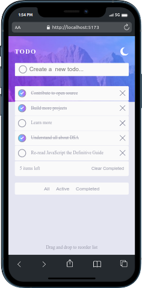
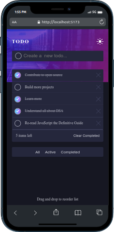
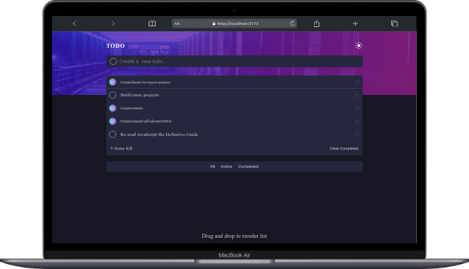
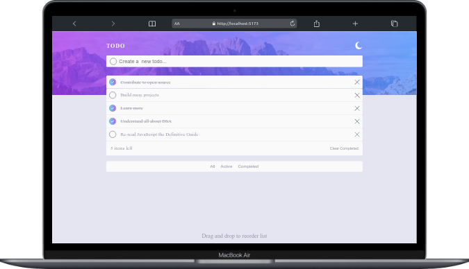

# Frontend Mentor - Todo app solution

This is a solution to the [Todo app challenge on Frontend Mentor](https://www.frontendmentor.io/challenges/todo-app-Su1_KokOW).

## Table of contents

- [Overview](#overview)
  - [The challenge](#the-challenge)
  - [Screenshot](#screenshot)
  - [Links](#links)
- [My process](#my-process)
  - [Built with](#built-with)
  - [What I learned](#what-i-learned)
- [Author](#author)

## Overview

### The challenge

Users should be able to:

- View the optimal layout for the app depending on their device's screen size
- See hover states for all interactive elements on the page
- Add new todos to the list
- Mark todos as complete
- Delete todos from the list
- Filter by all/active/complete todos
- Clear all completed todos
- Toggle light and dark mode
- Drag and drop to reorder items on the list

### Screenshot







### Links

- Solution URL: [view](https://pwa-multi-theme-todo.vercel.app/)
- Live Site URL: [view](https://pwa-multi-theme-todo.vercel.app/)

## My process

### Built with

- Semantic HTML5 markup
- CSS custom properties
- Flexbox
- Responsive Design
- Mobile-first workflow
- [React](https://reactjs.org/) - JS library

s

### What I learned

How to to convert a Vite + React App to PWA using the pwa-plugin-vite npm module

```js
import { VitePWA } from "vite-plugin-pwa";


 VitePWA({
      registerType: "prompt",
      includeAssets: [
        "favicon.ico",
        "apple-touch-icon.png",
      ],
      manifest: {
        name: "",
        short_name: "",
        description:
          "",
        theme_color: "#161722",
        background_color: "#161722",
        start_url: "/",
        icons: [
          {
            src: "maskable_icon_x128.png",
            sizes: "128x128",
            type: "image/png",
          },
          {
            src: "maskable_icon.png",
            sizes: "512x512",
            type: "image/png",
          },
          {
            src: "maskable_icon.png",
            sizes: "512x512",
            type: "image/png",
            purpose: "any maskable",
          },
        ],
      },
    }),
```

```css
/* light Theme */
.main.light {
  --very-dark-desaturated-blue: var(--very-light-gray);
  background-color: var(--very-light-grayish-blue);
  --very-Dark-Grayish-blue: var(--very-light-grayish-blue);
  --light-grayish-blue: var(--Dark-grayish-blue);
  --Light-grayish-blue: var(--Dark-grayish-blue);
}
.main.light .single__todo .todo__msg {
  color: var(--Dark-grayish-blue);
}
.main.light .single__todo .completed__todo {
  color: var(--Light-grayish-blue);
}
.main.light .banner__wrapper {
  background-image: url("/public/images/bg-desktop-light.jpg");
}
/* End of light theme */
```

## Author

- Frontend Mentor - [@isaac-svg](https://www.frontendmentor.io/profile/isaac-svg)
